# ftm.java

This repository is providing a Java (or JVM based) classes and records from the [Follow The Money](https://followthemoney.tech) models.

The goal is to use the YAML source files to generate Java records and classes, then publish a jar that contains the generated models.

The schema files are [here](https://github.com/alephdata/followthemoney/tree/main/followthemoney/schema).

This is a work in progress, for now, only "required" fields are generated in Java code.

To use it, just make `mvn package` it will generate and compile FtM models in a jar.

```mermaid
classDiagram
direction BT
class Address {
<<Interface>>

}
class Airplane {
<<Interface>>

}
class Analyzable {
<<Interface>>

}
class Article {
<<Interface>>

}
class Assessment
class Asset {
<<Interface>>

}
class Associate
class Audio {
<<Interface>>

}
class BankAccount {
<<Interface>>

}
class Call {
<<Interface>>

}
class CallForTenders
class Company
class Contract
class ContractAward
class CourtCase
class CourtCaseParty
class CryptoWallet {
<<Interface>>

}
class Debt
class Directorship
class Document
class Documentation
class EconomicActivity {
<<Interface>>

}
class Email {
<<Interface>>

}
class Employment
class Event
class Family
class Folder {
<<Interface>>

}
class HyperText {
<<Interface>>

}
class Identification
class Image {
<<Interface>>

}
class Interest {
<<Interface>>

}
class Interval {
<<Interface>>

}
class LegalEntity
class License
class Membership
class Mention
class Message
class Note {
<<Interface>>

}
class Occupancy
class Organization
class Ownership
class Package {
<<Interface>>

}
class Page {
<<Interface>>

}
class Pages {
<<Interface>>

}
class Passport
class Payment
class Person
class PlainText {
<<Interface>>

}
class Position
class Post
class Project {
<<Interface>>

}
class ProjectParticipant {
<<Interface>>

}
class PublicBody
class RealEstate {
<<Interface>>

}
class Representation
class Sanction
class Security {
<<Interface>>

}
class Similar {
<<Interface>>

}
class Succession
class Table {
<<Interface>>

}
class TaxRoll
class Thing
class Trip
class UnknownLink
class UserAccount
class Value {
<<Interface>>

}
class Vehicle {
<<Interface>>

}
class Vessel
class Video {
<<Interface>>

}
class Workbook {
<<Interface>>

}

Assessment  -->  Thing
Associate  ..>  Interval
CallForTenders  ..>  Interval
CallForTenders  -->  Thing
Company  ..>  Asset
Company  -->  Organization
Contract  ..>  Asset
Contract  -->  Thing
ContractAward  ..>  Interest
ContractAward  ..>  Value
CourtCase  -->  Thing
CourtCaseParty  ..>  Interest
Debt  ..>  Interval
Debt  ..>  Value
Directorship  ..>  Interest
Document  ..>  Analyzable
Document  -->  Thing
Documentation  ..>  Interest
Employment  ..>  Interest
Event  ..>  Analyzable
Event  ..>  Interval
Event  -->  Thing
Family  ..>  Interval
Identification  ..>  Interval
LegalEntity  -->  Thing
License  -->  Contract
Membership  ..>  Interest
Message  -->  Document
Message  ..>  Folder
Message  ..>  HyperText
Message  ..>  Interval
Message  ..>  PlainText
Occupancy  ..>  Interval
Organization  -->  LegalEntity
Ownership  ..>  Interest
Passport  -->  Identification
Payment  ..>  Interval
Payment  ..>  Value
Person  -->  LegalEntity
Position  -->  Thing
Post  ..>  Interest
PublicBody  -->  Organization
Representation  ..>  Interest
Sanction  ..>  Interval
Succession  ..>  Interest
TaxRoll  ..>  Interval
Trip  -->  Event
UnknownLink  ..>  Interest
UserAccount  -->  Thing
Vessel  -->  Thing
Vessel  ..>  Vehicle 
```

